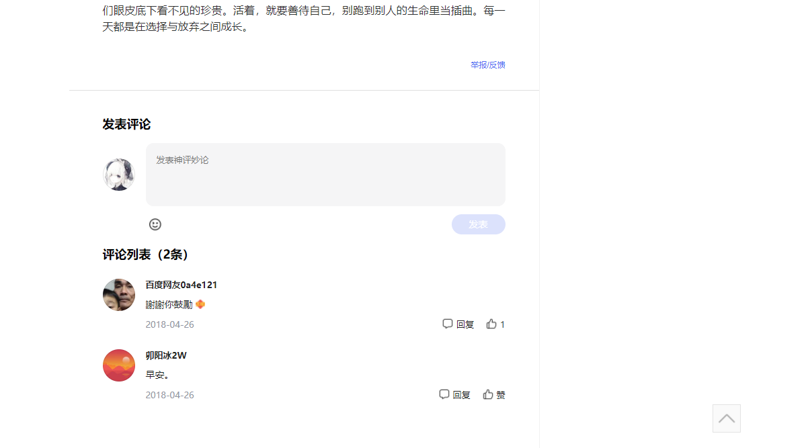

个人博客计划


> 目前已实现

简单的登录功能
简单的注册功能
简单的用户列表查询功能
简单的拦截功能（未开启）
简单的删除用户功能

> 未实现

注册时前端验证重复密码


```shell
# 添加当前目录的所有文件到暂存区
$ git add .
# 提交暂存区到仓库区
$ git commit -m [message]
# 推送到远程仓库（第一次时
$ git push -u origin main
# 第一次之后可以
$ git push origin main
```


素材参考




